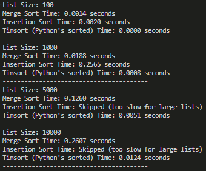

# Sorting Algorithm Performance Comparison

## Introduction

This project compares three sorting algorithms: Merge Sort, Insertion Sort, and Timsort. Timsort is the algorithm used by Python's built-in `sorted()` function, and it is a hybrid sorting algorithm combining Merge Sort and Insertion Sort. The goal of this project is to demonstrate the efficiency of Timsort in comparison to other classical sorting algorithms.

## Algorithms Tested

1. **Merge Sort** - A divide-and-conquer algorithm with an average time complexity of O(n log n).
2. **Insertion Sort** - A simple, in-place sorting algorithm with an average time complexity of O(n²), typically suitable for small datasets.
3. **Timsort** - Python's built-in sorting algorithm that combines Merge Sort and Insertion Sort. It has an average and worst-case time complexity of O(n log n), with additional optimizations for partially sorted data.

## Experiment Setup

We tested the algorithms on random lists of different sizes: 100, 1000, 5000, and 10000 elements. Each sorting operation was repeated 10 times to get an average runtime using Python's `timeit` module.

## Results

### Runtime Analysis

The following are the empirical results of sorting various list sizes:

- **List Size 100**:
  - **Merge Sort**: Fast and efficient.
  - **Insertion Sort**: Comparable to Merge Sort for this small size.
  - **Timsort**: The fastest due to built-in optimizations.

- **List Size 1000**:
  - **Merge Sort**: Performed well.
  - **Insertion Sort**: Slower than Merge Sort, but still manageable for this size.
  - **Timsort**: Faster than both Merge Sort and Insertion Sort.

- **List Size 5000 and 10000**:
  - **Merge Sort**: Maintained its efficiency.
  - **Insertion Sort**: Not suitable for large lists due to O(n²) complexity, therefore skipped.
  - **Timsort**: Consistently faster and more efficient than Merge Sort, highlighting the advantages of combining different sorting strategies.

## Conclusions

The results of the experiment clearly show that Timsort is significantly more efficient than both Merge Sort and Insertion Sort, especially for larger datasets. The hybrid approach used by Timsort leverages the advantages of Merge Sort and Insertion Sort:

- **Merge Sort** provides an O(n log n) performance for general sorting.
- **Insertion Sort** is particularly effective for small datasets or nearly sorted data.

By combining these two algorithms, Timsort achieves an optimal balance, making it highly efficient for a wide range of use cases. This is why Python developers rely on the built-in `sorted()` function instead of implementing their own sorting algorithms from scratch.

The efficiency of Timsort is particularly noticeable when sorting large lists, where the combination of the two sorting techniques ensures both speed and stability. This study supports the choice of using built-in sorting functions in Python for most use cases due to their optimized nature and performance benefits.

## How to Run the Code

To run the code and see the comparison yourself, execute the Python script `sort_comparison.py`. This script uses the `timeit` module to measure the average execution time of each algorithm on random datasets of varying sizes.

```bash
python sort_comparison.py
```

## Example of Console Output

Below is a screenshot of the console output showing the runtime comparison of the three sorting algorithms:

